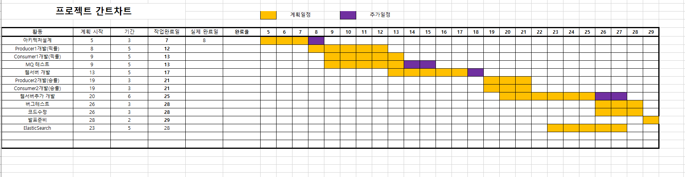
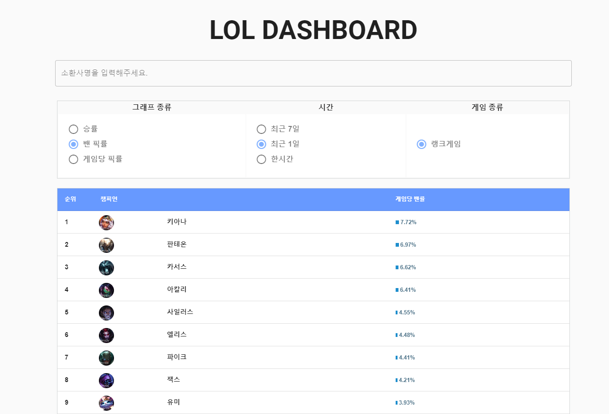
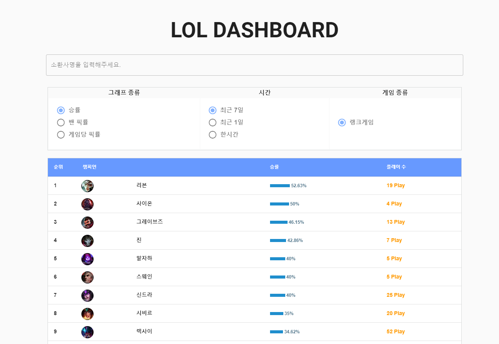
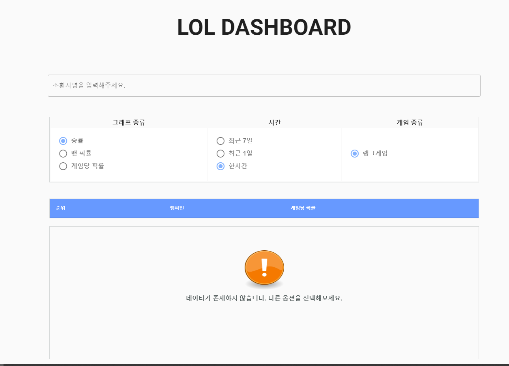
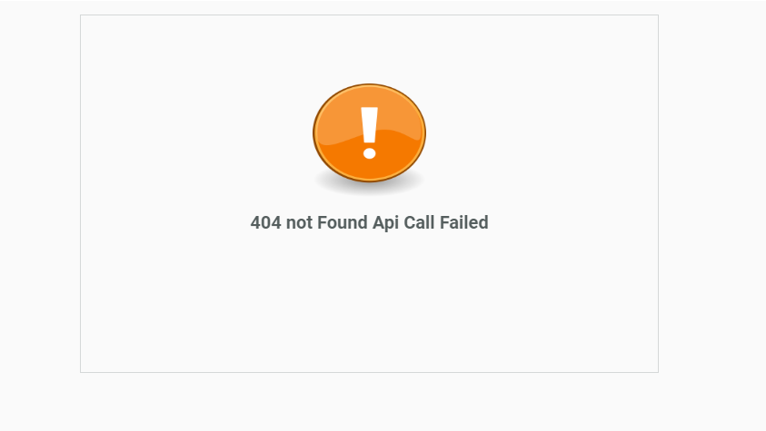

LOL-DASHBOARD  
 -  

현재 진행 중인 게임의 한시간, 오늘, 일주일 등의 게임 픽률과 밴픽률, 그리고 오늘과 일주일동안의 챔피온의 승률을 볼 수 있는 DASHBOARD. 

# 기획

- 인기게임 League of Regend 의 데이터를 활용하여 현재 게임을 플레이하고 있는 게임 유저의 정보를 반영하여 게임에 대한 이해도를 향상시켜 원활한 게임 진행 가능.

# 개발환경
 - DataBase 
  1. Cloud DB For Redis (Redis 4.0.2)
  2. ElasticSearch 6.6.0

 - Message Queue
  1. Rabbit Mq 3.7.0
  
 - Web 
  1. CentoOs 7.3 64Bit
  2. JDK 1.8
  3. TomCat
  4. Vue.js 3.1.0
  5. Vuetify 2.0.11

- Api
 1. Riot Games Api

- [Project Issue](https://oss.navercorp.com/2019-Ncloud-Intern-Program/teahwan.kim_2nd/projects/1)

- 아키텍처

- 간트차트

 - 개발 진행 순서.

- 아키텍처 설계 (2019.08.05 -  2019.08.08)
- InGame Data Producer (2019.08.08 - 2019.08.12)
1. Producer에 Exchange와 InGaeme Queue Binding 설정.
2. 30초마다 스케줄링으로 Riot Games에 InGame Data 요청.
3. 요청 받은 Json Data 를 InGame Queue 삽입.

- InGame Data Consumer (2019.08.09 - 2019.08.13)
1. Producer가 보낸 보낸 데이터를 모델에 받아 챔피온의 픽률과 밴픽률을 
Redis Server에 {게임모드-시간}{날짜} 키에 tuple(pickchampionId, score: 1) 값으로 
set 데이터에 저장.

- MQ 테스트 (2019.09.09 - 2019.09.13)

- Web Server 개발 (2019.09.13 - 2019.09.18)
 1. Redis에 저장된 데이터를 불러와 사용자가 요청할 때 데이터를 보냄.
  -> Redis Publish Subscribe를 활용하여 Redis에 데이터가 갱신될때마다 각 기능에 맞는 데이터를 Redis에 저장.  

- Finished Game Data Producer 개발 (2019.08.19 – 2019.08.21)
 1. 매시 정각 마다 Redis에 저장되어진 진행이 되어진 Game Id에서 해당 게임의 결과를 확인하고, 게임이 종료되었으면 호출된 결과를 Exchange 에 전달.

- Finished Game Data Consumer 개발 (2019.08.19 – 2019.08.21)
1. Producer가 보낸 데이터를 모델에 받아 ElasticSearch에 해당 데이터를 저장.

- 웹 서버 추가 개발(승률 기능 추가) (2019.08.20 – 2019.08.27)
1. 사용자가 승률 데이터를 요청 시 ElasticSearch에 검색 쿼리를 날려 챔피온들의 승률 데이터를 가져옴.

2. Redis에서 사용자 SessionId를 관리하여 SessionId가 있고, Redis에 데이터가 갱신될때마다 사용자들에게 게임픽률과 밴픽률 데이터를 BroadCasting으로 전달.

3. 초기 사용자 접속시 사용자의 Session을 Redis에 저장하고 게임픽률과 밴픽률 데이터 전부를 클라이언트에 전달.

- 버그 테스트 (2019.08.26 – 2019.08.28)

1. 다른 사용자가 동시 접속시 UI 변동 현상 점검.

2. SessionId가 존재하지 않을 시 BroadCasting이 되지않아야하는 동작 점검.

3. HTTP 요청을 보냈을 때 오류 발생 시 사용자에게 Error Page를 보여주도록 조치.
   (WebSocket 연결이 끈겼거나, HTTP 요청이 제대로 실행되지 않았을때)

- 코드 수정 (2019.08.26 – 2019.08.28)

1. Producer, Consumer, WebServer에 각 기능별로 log를 남겨서 날짜별로 log 파일 처리. 

2. 각 기능 별로 Service 분할.

- 발표 준비  (2019.08.29 – 2019.08.29)

1. PPt 제작.

[시연 링크](http://slb-2258354.ncloudslb.com/)

UI 그림

- UI 게임 챔피온 픽률 

- UI 게임 챔피온 밴픽률

- UI 게임 챔피온 승률

- 데이터 없음

- 에러 메세지

