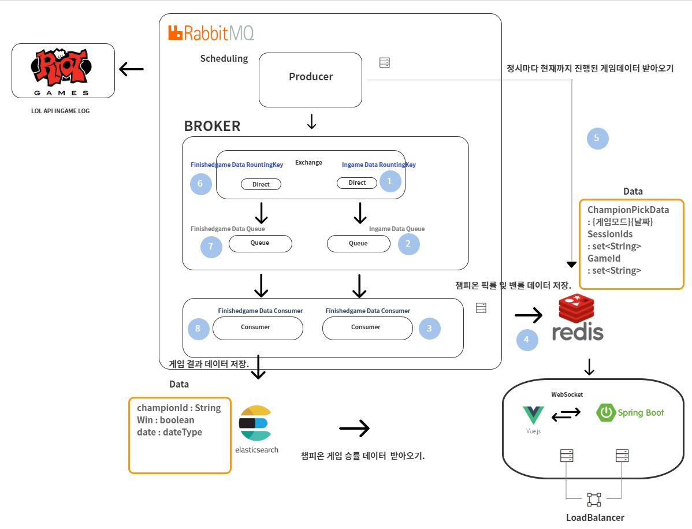
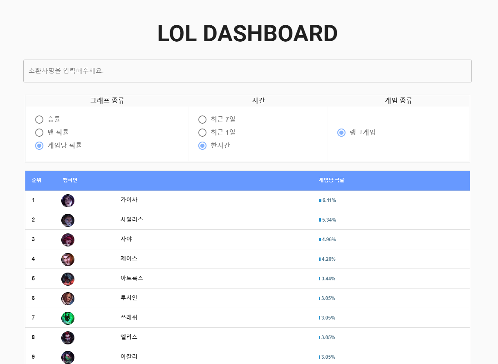

LOL-DASHBOARD  
 -  

현재 진행 중인 게임의 한시간, 오늘, 일주일 등의 게임 픽률과 밴픽률, 그리고 오늘과 일주일동안의 챔피온의 승률을 볼 수 있는 DASHBOARD. 

# 기획

- 인기게임 League of Regend 의 데이터를 활용하여 현재 게임을 플레이하고 있는 게임 유저의 정보를 반영하여 게임에 대한 이해도를 향상시켜 원활한 게임 진행 가능.

# 개발환경
 - DataBase 
  1. Cloud DB For Redis (Redis 4.0.2)
  2. ElasticSearch 6.6.0

 - Message Queue
  1. Rabbit Mq 3.7.0
  
 - Web 
  1. CentoOs 7.3 64Bit
  2. JDK 1.8
  3. TomCat
  4. Vue.js 3.1.0
  5. Vuetify 2.0.11

- Api
 1. Riot Games Api

- [Project Issue](https://oss.navercorp.com/2019-Ncloud-Intern-Program/teahwan.kim_2nd/projects/1)

- 아키텍처

- 간트차트

 - 개발 진행 순서.

- 아키텍처 설계 (2019.08.05 -  2019.08.08)
- InGame Data Producer (2019.08.08 - 2019.08.12)
1. Producer에 Exchange와 InGaeme Queue Binding 설정.
2. 30초마다 스케줄링으로 Riot Games에 InGame Data 요청.
3. 요청 받은 Json Data 를 InGame Queue 삽입.

- InGame Data Consumer (2019.08.09 - 2019.08.13)
1. Producer가 보낸 보낸 데이터를 모델에 받아 챔피온의 픽률과 밴픽률을 
Redis Server에 {게임모드-시간}{날짜} 키에 tuple(pickchampionId, score: 1) 값으로 
set 데이터에 저장.

- MQ 테스트 (2019.09.09 - 2019.09.13)

- Web Server 개발 (2019.09.13 - 2019.09.18)
 1. Redis에 저장된 데이터를 불러와 사용자가 요청할 때 데이터를 보냄.
  -> Redis Publish Subscribe를 활용하여 Redis에 데이터가 갱신될때마다 각 기능에 맞는 데이터를 Redis에 저장. 

UI 그림

- UI 게임 챔피온 픽률 

- UI 게임 챔피온 밴픽률

- UI 게임 챔피온 승률

- 데이터 없음

- 에러 메세지

